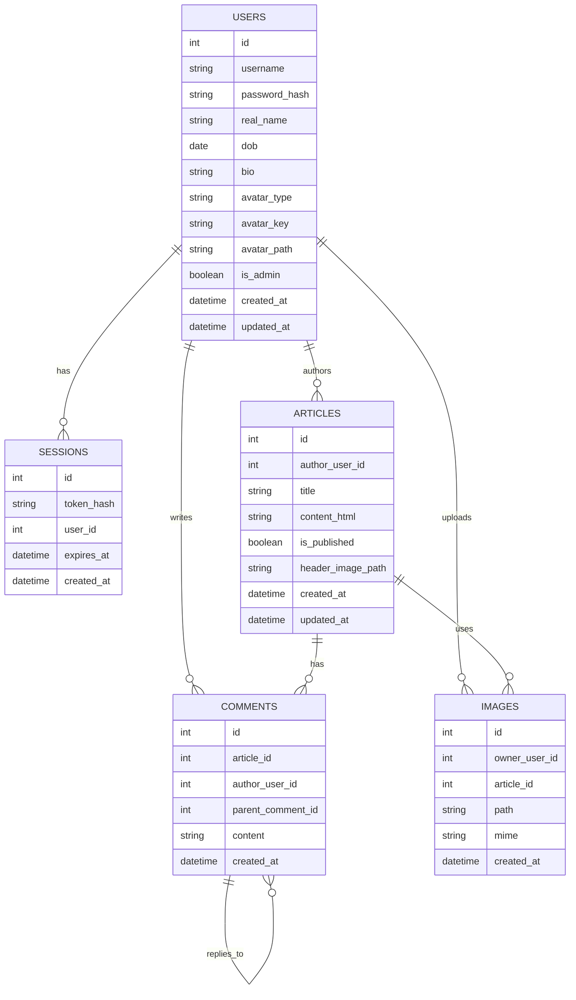

## Planning & initial design (Check-in package)

This section is written to match `PGCIT-Project-Brief-LY-2025.pdf`:

1. Risk mitigation strategy plan
2. Sprint backlog with initial task allocation
3. ER diagram & API design
4. Optional front end interface design (e.g. Figma)

### 1) Risk mitigation strategy plan

See `RISK_MITIGATION_PLAN.md`.

### 2) Sprint backlog with initial task allocation

See `SPRINT_BACKLOG_ALLOCATION.md`.

### 3) ER diagram & API design

This section is the **single source of truth** for the ER diagram + API design (the older separate ERD/API doc has been removed).

#### ER diagram (Mermaid)



**Table constraints** (written outside Mermaid to avoid parse errors):

Primary Keys (PK):

- `USERS.id`, `SESSIONS.id`, `ARTICLES.id`, `COMMENTS.id`, `IMAGES.id`

Foreign Keys (FK):

- `SESSIONS.user_id` → `USERS.id`
- `ARTICLES.author_user_id` → `USERS.id`
- `COMMENTS.article_id` → `ARTICLES.id`
- `COMMENTS.author_user_id` → `USERS.id`
- `COMMENTS.parent_comment_id` → `COMMENTS.id` (nullable, for nested replies)
- `IMAGES.owner_user_id` → `USERS.id`
- `IMAGES.article_id` → `ARTICLES.id` (nullable)

Unique constraints:

- `USERS.username` (unique)
- `SESSIONS.token_hash` (unique)

**Field notes**:

- `USERS.avatar_type`: either `predefined` or `upload`
- `USERS.avatar_key`: used when `avatar_type = predefined`
- `USERS.avatar_path`: used when `avatar_type = upload`
- `COMMENTS.parent_comment_id`: nullable (null = top-level comment)
- `IMAGES.article_id`: nullable (null = not linked to a specific article)
- Image "type" (avatar/article/header) is inferred by upload endpoint/folder (not stored in DB)

## Relational Model (Database Tables)

Based on the ER diagram above (in this document).

### What this is (entry-level)

This document shows each database table in **relational notation** — the format you'll use to write SQL `CREATE TABLE` statements. Each table lists:

- Column names and data types
- Primary Key (PK)
- Foreign Keys (FK) with references
- Unique constraints
- Nullable fields
- Cascade delete rules

---

### Table 1: USERS

**Purpose**: Store user accounts and profiles (Req. 1–7)

```
USERS(
  id: INT [PK],
  username: VARCHAR(50) [UNIQUE, NOT NULL],
  password_hash: VARCHAR(255) [NOT NULL],
  real_name: VARCHAR(100),
  dob: DATE,
  bio: TEXT,
  avatar_type: ENUM('predefined', 'upload') [DEFAULT 'predefined'],
  avatar_key: VARCHAR(50),
  avatar_path: VARCHAR(255),
  is_admin: BOOLEAN [DEFAULT FALSE],
  created_at: TIMESTAMP [DEFAULT CURRENT_TIMESTAMP],
  updated_at: TIMESTAMP [DEFAULT CURRENT_TIMESTAMP]
)
```

**Constraints**:

- `username` must be unique (checked when registering and editing profile)
- `password_hash` stores bcrypt hash (never plaintext)
- `real_name` and `dob` are nullable at the DB level in the current implementation (validation can still be enforced in the API/UI)
- `avatar_type = 'predefined'` → use `avatar_key`
- `avatar_type = 'upload'` → use `avatar_path`
- Note: in SQLite, `updated_at` is updated by the application (e.g. `updated_at = datetime('now')`), not automatically via `ON UPDATE`

---

### Table 2: SESSIONS

**Purpose**: Track logged-in users (cookie-based auth)

```
SESSIONS(
  id: INT [PK],
  token_hash: VARCHAR(255) [UNIQUE, NOT NULL],
  user_id: INT [FK → USERS(id) ON DELETE CASCADE, NOT NULL],
  expires_at: TIMESTAMP [NOT NULL],
  created_at: TIMESTAMP [DEFAULT CURRENT_TIMESTAMP]
)
```

```
┌─────────────┐                    ┌─────────────┐
│   Browser   │                    │   Server    │
└─────────────┘                    └─────────────┘
      │                                   │
      │  1. POST /api/login               │
      │  (username + password)            │
      │──────────────────────────────────>│
      │                                   │
      │  2. Check credentials             │
      │     Create session in DB          │
      │                                   │
      │  3. 200 OK                        │
      │     Set-Cookie: session=abc123    │
      │<──────────────────────────────────│
      │  (cookie stored in browser)       │
      │                                   │
      │                                   │
      │  4. Later: GET /api/articles      │
      │     Cookie: session=abc123        │
      │──────────────────────────────────>│
      │                                   │
      │  5. Check SESSIONS table          │
      │     Token valid? Not expired?     │
      │     → User authenticated! ✓       │
      │                                   │
      │  6. 200 OK (with articles)        │
      │<──────────────────────────────────│
```

**Constraints**:

- `token_hash` is unique (hashed session token stored in cookie)
- When a user is deleted, their sessions are deleted (cascade)

---

### Table 3: ARTICLES

**Purpose**: Store blog posts (Req. 8–12)

```
ARTICLES(
  id: INT [PK],
  author_user_id: INT [FK → USERS(id) ON DELETE CASCADE, NOT NULL],
  title: VARCHAR(255) [NOT NULL],
  content_html: TEXT [NOT NULL],
  is_published: BOOLEAN [DEFAULT TRUE],
  header_image_path: VARCHAR(255),
  created_at: TIMESTAMP [DEFAULT CURRENT_TIMESTAMP],
  updated_at: TIMESTAMP [DEFAULT CURRENT_TIMESTAMP]
)
```

**Constraints**:

- `author_user_id` links to the user who wrote the article
- When a user is deleted, all their articles are deleted (cascade) (Req. 7)
- `content_html` stores WYSIWYG editor output
- `header_image_path` is optional (Req. 12)
- `is_published` is optional (only needed if you choose draft/publish as custom feature)
- Note: in SQLite, `updated_at` is updated by the application (e.g. `updated_at = datetime('now')`), not automatically via `ON UPDATE`

---

### Table 4: COMMENTS

**Purpose**: Store comments on articles + nested replies (Req. 13–16)

```
COMMENTS(
  id: INT [PK],
  article_id: INT [FK → ARTICLES(id) ON DELETE CASCADE, NOT NULL],
  author_user_id: INT [FK → USERS(id) ON DELETE CASCADE, NOT NULL],
  parent_comment_id: INT [FK → COMMENTS(id) ON DELETE CASCADE, NULL],
  content: TEXT [NOT NULL],
  created_at: TIMESTAMP [DEFAULT CURRENT_TIMESTAMP]
)
```

**Constraints**:

- `article_id` links to the article being commented on
- `author_user_id` links to the user who wrote the comment
- `parent_comment_id` is **nullable**:
  - `NULL` = top-level comment (directly on article)
  - `NOT NULL` = reply to another comment (enables unlimited nesting, Req. 15)
- When an article is deleted, all its comments are deleted (cascade)
- When a user is deleted, all their comments are deleted (cascade) (Req. 7)
- When a comment is deleted, all its replies are deleted (cascade) — simplest approach

**Index recommendation** (optional, for performance):

- Index on `article_id` (fast lookup of all comments for an article)
- Index on `parent_comment_id` (fast lookup of replies to a comment)

---

### Table 5: IMAGES

**Purpose**: Store metadata for uploaded images (avatars, article images)

```
IMAGES(
  id: INT [PK],
  owner_user_id: INT [FK → USERS(id) ON DELETE CASCADE, NOT NULL],
  article_id: INT [FK → ARTICLES(id) ON DELETE SET NULL, NULL],
  path: VARCHAR(255) [NOT NULL],
  mime: VARCHAR(50) [NOT NULL],
  created_at: TIMESTAMP [DEFAULT CURRENT_TIMESTAMP]
)
```

**Constraints**:

- `owner_user_id` = user who uploaded the image
- `article_id` is **nullable**:
  - `NULL` = avatar or not yet linked
  - `NOT NULL` = embedded or header image for a specific article
- Image usage is inferred by upload folder:
  - `uploads/avatars/` = user avatar
  - `uploads/article-images/` = embedded in article content (via TinyMCE)
  - `uploads/header-images/` = article header image (Req. 12)
- `path` = file path on server (e.g., `uploads/avatars/abc123.jpg`)
- `mime` = MIME type (e.g., `image/jpeg`, `image/png`) for validation

---

## Summary of Foreign Key CASCADE Rules

These rules ensure **referential integrity** and meet the brief requirements:

| Parent Table | Child Table | FK Column         | ON DELETE CASCADE | Why                                                |
| ------------ | ----------- | ----------------- | ----------------- | -------------------------------------------------- |
| USERS        | SESSIONS    | user_id           | ✓                 | Deleting user logs them out                        |
| USERS        | ARTICLES    | author_user_id    | ✓                 | Req. 7: delete user → delete their articles        |
| USERS        | COMMENTS    | author_user_id    | ✓                 | Req. 7: delete user → delete their comments        |
| USERS        | IMAGES      | owner_user_id     | ✓                 | Delete user → delete their uploaded images         |
| ARTICLES     | COMMENTS    | article_id        | ✓                 | Delete article → delete all its comments           |
| ARTICLES     | IMAGES      | article_id        | ✗ (SET NULL)      | Delete article → keep image record, unlink article |
| COMMENTS     | COMMENTS    | parent_comment_id | ✓                 | Delete comment → delete all its replies (simplest) |

---

## Example SQL CREATE TABLE Statements

These match the current SQLite schema in `db/db-init.sql`:

```sql
CREATE TABLE users (
  id INTEGER PRIMARY KEY AUTOINCREMENT,
  username TEXT NOT NULL UNIQUE,
  password_hash TEXT NOT NULL,
  real_name TEXT,
  dob TEXT,
  bio TEXT,
  avatar_type TEXT NOT NULL DEFAULT 'predefined' CHECK (avatar_type IN ('predefined','upload')),
  avatar_key TEXT,
  avatar_path TEXT,
  is_admin INTEGER NOT NULL DEFAULT 0 CHECK (is_admin IN (0,1)),
  created_at TEXT NOT NULL DEFAULT (datetime('now')),
  updated_at TEXT NOT NULL DEFAULT (datetime('now'))
);

CREATE TABLE articles (
  id INTEGER PRIMARY KEY AUTOINCREMENT,
  author_user_id INTEGER NOT NULL,
  title TEXT NOT NULL,
  content_html TEXT NOT NULL DEFAULT '',
  header_image_path TEXT,
  is_published INTEGER NOT NULL DEFAULT 1 CHECK (is_published IN (0,1)),
  created_at TEXT NOT NULL DEFAULT (datetime('now')),
  updated_at TEXT NOT NULL DEFAULT (datetime('now')),
  FOREIGN KEY (author_user_id) REFERENCES users(id) ON DELETE CASCADE
);

CREATE TABLE comments (
  id INTEGER PRIMARY KEY AUTOINCREMENT,
  article_id INTEGER NOT NULL,
  author_user_id INTEGER NOT NULL,
  parent_comment_id INTEGER,
  content TEXT NOT NULL,
  created_at TEXT NOT NULL DEFAULT (datetime('now')),
  FOREIGN KEY (article_id) REFERENCES articles(id) ON DELETE CASCADE,
  FOREIGN KEY (author_user_id) REFERENCES users(id) ON DELETE CASCADE,
  FOREIGN KEY (parent_comment_id) REFERENCES comments(id) ON DELETE CASCADE
);

CREATE TABLE images (
  id INTEGER PRIMARY KEY AUTOINCREMENT,
  owner_user_id INTEGER NOT NULL,
  article_id INTEGER,
  path TEXT NOT NULL,
  mime TEXT NOT NULL,
  created_at TEXT NOT NULL DEFAULT (datetime('now')),
  FOREIGN KEY (owner_user_id) REFERENCES users(id) ON DELETE CASCADE,
  FOREIGN KEY (article_id) REFERENCES articles(id) ON DELETE SET NULL
);

CREATE TABLE sessions (
  id INTEGER PRIMARY KEY AUTOINCREMENT,
  token_hash TEXT NOT NULL UNIQUE,
  user_id INTEGER NOT NULL,
  expires_at TEXT NOT NULL,
  created_at TEXT NOT NULL DEFAULT (datetime('now')),
  FOREIGN KEY (user_id) REFERENCES users(id) ON DELETE CASCADE
);
```

---

## Next Steps

1. Copy the SQL above into `db/db-init.sql`
2. Add seed data (at least 2 test users + sample articles + nested comments)
3. Test cascade deletes manually:
   - Create user → create article → add comments → delete user
   - Verify articles + comments are gone

## API design (endpoint list)

Status codes used:

- 200 OK
- 201 Created
- 204 No Content
- 400 Bad Request
- 401 Not logged in
- 403 Not allowed
- 404 Not found
- 409 Conflict (e.g. username already taken)

Auth (explicit admin requirements):

| Method | Path          | Auth     | Purpose                           | Success          | Errors |
| ------ | ------------- | -------- | --------------------------------- | ---------------- | ------ |
| POST   | `/api/login`  | No       | Authenticate user; create session | 200 + set cookie | 401    |
| POST   | `/api/logout` | Optional | Destroy session                   | 204              | 204    |
| GET    | `/api/me`     | Yes      | Return current user profile       | 200              | 401    |

Username availability (Req. 2):

| Method | Path                             | Auth | Purpose                          | Success           | Errors |
| ------ | -------------------------------- | ---- | -------------------------------- | ----------------- | ------ |
| GET    | `/api/users/exists?username=...` | No   | Live username availability check | 200 `{available}` | 400    |

Users (website self-service):

| Method | Path                    | Auth | Purpose                          | Success     | Errors        |
| ------ | ----------------------- | ---- | -------------------------------- | ----------- | ------------- |
| POST   | `/api/users`            | No   | Register user                    | 201         | 400, 409      |
| PATCH  | `/api/users/me`         | Yes  | Edit profile (incl. username)    | 200         | 400, 401, 409 |
| DELETE | `/api/users/me`         | Yes  | Delete own account               | 204         | 401           |
| POST   | `/api/users/me/avatar`  | Yes  | Upload avatar image              | 200/204     | 400, 401      |
| GET    | `/api/users/:id/avatar` | No   | Serve avatar image (web + Swing) | 200 (image) | 404           |

Articles (Req. 8–12):

| Method | Path                                         | Auth     | Purpose                          | Success     | Errors             |
| ------ | -------------------------------------------- | -------- | -------------------------------- | ----------- | ------------------ |
| GET    | `/api/articles?q=&sort=&order=&mine=`        | Optional | List/search/sort                 | 200         | 400                |
| POST   | `/api/articles`                              | Yes      | Create article                   | 201         | 400, 401           |
| GET    | `/api/articles/:id`                          | Optional | View article                     | 200         | 404                |
| PATCH  | `/api/articles/:id`                          | Yes      | Edit article (author/admin)      | 200         | 400, 401, 403, 404 |
| DELETE | `/api/articles/:id`                          | Yes      | Delete article (author/admin)    | 204         | 401, 403, 404      |
| POST   | `/api/articles/:id/header-image`             | Yes      | Upload/replace header image      | 200/204     | 400, 401, 403      |
| POST   | `/api/articles/:id/header-image?remove=true` | Yes      | Remove header image              | 204         | 400, 401, 403      |
| POST   | `/api/articles/:id/images`                   | Yes      | Upload embedded image for editor | 200 `{url}` | 400, 401, 403      |

Comments (Req. 13–16):

| Method | Path                         | Auth     | Purpose                                   | Success | Errors        |
| ------ | ---------------------------- | -------- | ----------------------------------------- | ------- | ------------- |
| GET    | `/api/articles/:id/comments` | Optional | Fetch comments for article                | 200     | 404           |
| POST   | `/api/articles/:id/comments` | Yes      | Add comment/reply                         | 201     | 400, 401, 404 |
| DELETE | `/api/comments/:id`          | Yes      | Delete (comment author OR article author) | 204     | 401, 403, 404 |

Admin endpoints (explicitly required for Swing):

| Method | Path             | Auth  | Purpose                         | Success | Errors        |
| ------ | ---------------- | ----- | ------------------------------- | ------- | ------------- |
| GET    | `/api/users`     | Admin | List all users + articleCount   | 200     | 401, 403      |
| DELETE | `/api/users/:id` | Admin | Delete user + all their content | 204     | 401, 403, 404 |

## Frontend routes (SvelteKit file-based routing)

SvelteKit uses automatic file-based routing with clean URLs (no hash routing):

- `/` — Article list (home page) → `src/routes/+page.svelte`
- `/login` — Login page → `src/routes/login/+page.svelte`
- `/register` — Registration page → `src/routes/register/+page.svelte`
- `/profile` — User profile → `src/routes/profile/+page.svelte`
- `/article/[id]` — Article detail view (dynamic route) → `src/routes/article/[id]/+page.svelte`
- `/editor` — Article editor (create new) → `src/routes/editor/+page.svelte`
- `/editor/[id]` — Article editor (edit existing) → `src/routes/editor/[id]/+page.svelte`

**Shared layout:** `src/routes/+layout.svelte` contains the navigation bar displayed on all pages.

### 4) Optional front end interface design (wireframes)

See `WIREFRAMES.md`.
